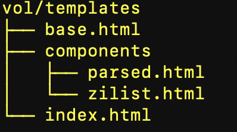

# Chinese Writer, rust version

This is basically a port to rust language of my Chinese-character-writer, written in GO.

Here are some comments on my experience in developing this app.

## 1. axum vs actix-web ?
axum and actix-web are among the current web frameworks available for rust development.
I transitioned from actix-web to axum when trying to work on the Shuttle platform. I gave up on Shuttle (which did not fit my needs) but not on axum.

There are a lot of comparisons available about these frameworks (see for example [https://infobytes.guru/articles/rust-web-framework-comparison.html](https://infobytes.guru/articles/rust-web-framework-comparison.html) ). However, from a developer's point of view both are quite similar. To the advantage of axum, I note that you need to distinguish between GET and POST handlers only in one place in axum (when binding the handler with the routing system) instead of two in actix-web, where you also have to add a macro `#[get("/handler")]` or `#[post("/handler")]` in the handler definition, which may be a nuisance when refactoring your code.

Both play very well with the `tera` templating system, and with the `sqlx` SQL crate, meaning I had little to modify in the dbase module.

## 2. Combining axum, htmx and tera

### 2.1 Tera templating: subtemplates

I wrote about using the tera templating system [here](https://medium.com/@francis.stephan/developing-a-web-app-with-rust-part-3-tera-templating-system-and-htmx-531e49e28ca2).

One interesting point, for which I could no longer find adequate documention, is the concept of subtemplates. Here is my templates tree:




The index.html file is as follows:
```html




<div id="content">
  Select a menu item hereabove to get started
  <p>{{ contenu }}</p>
</div>


```

I have two subtemplates: parsed.html and zilist.html, which are in the 'components' folder. For instance, here is the code for `zilist.html` :

```html
<div id="content">
  
     No results for query '{{query}}'
  
    Results for query '{{query}}':
    <table><tr><td>Strokes</td><td>Pinyin</td><td>Unicode</td><td>Character</td><td>Translation</td></tr>

    
    <tr><td>{{zi.strokes}}</td><td>{{zi.pinyin_ton}}</td><td>{{zi.unicode}}</td><td>{{zi.hanzi}}</td><td>{{zi.sens}}</td></tr>
    
    </table>

  
</div>
```

When I ask tera to render components/zilist.html, the `<div id="content">` div is substituted for the div in index.html:

```rust
pub async fn pylist(
    State(client): State<Arc<AppState>>,
    Form(chardata): Form<dbase::PinyinData>, // caution:the extractor should follow the state
) -> impl IntoResponse {
    let chain = &chardata.pinyin_ton; // extract chardata from the form, using serde::deserialize
    let mut ctx = tera::Context::new(); // the tera context will receive required data for the template: query and dico
    ctx.insert("query", &chain);
    let disp = dbase::list_for_py(client, String::from(chain)).await; // query database
    ctx.insert("dico", &disp);
    let output = TERA.render("components/zilist.html", &ctx); // tera rendering
    Html(output.unwrap()) // html page reloaded
}
```

The `{{query}}` field in the template is dealt with in `ctx.insert("query", &chain);` and the `dico` field in `ctx.insert("dico", &disp);` .

### 2.2 tera rendering vs direct rendering::

The rendering mode we just saw I call "tera rendering":

```rust
    let output = TERA.render("components/zilist.html", &ctx);
    Html(output.unwrap())
```
Now there are other content that do not need tera rendering. Take for instance in the program's menu the `size` tab, which triggers an htmx call as follows :
```html
<li hx-trigger="click" hx-get="/size" hx-target="#content" hx-swap="innerHTML">
```
This reads that a click on the element triggers an htmx event, calling the /size route; the div with id = `content` will be overwritten by the anwser, will fill the div's innerHTML. The /size handler reads as follows:
```rust
pub async fn size(State(client): State<Arc<AppState>>) -> impl IntoResponse {
    let size = dbase::getsize(client).await;  // query database to get size
    let metadata = fs::metadata("vol/zidian.db").expect("Failed to read file metadata"); 
    let time = metadata.modified().unwrap();
    use chrono::prelude::{DateTime, Utc};
    let dt: DateTime<Utc> = time.clone().into(); // sqlite.db's last update
    let content = format!(
        "The dictionary presently contains {} entries. Last updated on {}",
        &size,
        &dt.format("%Y-%m-%d")
    );
    content.into_response() // directly render in the div with id = content
}
```
The rendering of the `content` String is performed in the last line: `content.into_response()` : tera is not involved here, only htmx which provides for an ajax call, the div with id = `content` gets updated with a text such as "The dictionary presently contains 2634 entries. Last updated on 2025-06-30". No page reload occurs. This I call direct rendering.

> To sum up:
> - tera has powerful rendering options (such as appear in the `zilist.html` file here above). Whenever you need these options, write adequate subtemplates and use tera rendering;
> - otherwise, if answering to an htmx request, just render the string directly using what I called direct rendering.
>

### 2.3 Programmatically trigger htmx form:

I have the following htmx form:
```html
<form id="postzi" hx-post="/candidatelist" hx-target="#zilist" hx-swap="innerHTML">
    <label for="pinyin">Enter pinyin+tone (press / or space after pinyin if tone unknown) :</label>
    <input type='text' id='pinyin' name='pinyin_ton' size='10' autofocus oninput='convertToZi()'>
</form>
```
I do not mention hx-trigger, since the dafault trigger for htmx forms is 'submit'. But I do not want a submit button: the text input is listened to by the javascript `convertToZi()` function (in vol/assets/chwriter.js), which has its own criteria to decide when the form is submitted. So I tried several ways to trigger the `submit` event; the only one that worked looks like a hack, but it works:
- I include an invisible button in the form, as follows:
```html
<form id="postzi" hx-post="/candidatelist" hx-target="#zilist" hx-swap="innerHTML">
    <label for="pinyin">Enter pinyin+tone (press / or space after pinyin if tone unknown) :</label>
    <input type='text' id='pinyin' name='pinyin_ton' size='10' autofocus oninput='convertToZi()'>
    <button id="subpy" style="display:none" type="submit"></button>
</form>
```
- I trigger the form with the following line (from `convertToZi`):
```js
    const button = document.getElementById("subpy");
    button.click();
```
## 3. Better Dockerfile

Many thanks to [Stefan Seemayer](https://blog.semicolonsoftware.de/building-minimal-docker-containers-for-rust-applications/, ) for his indications on a better Dockerfile for rust.

With this Dockerfile my deploy time was reduced from minutes to seconds, which is a life changer. Here it is:
```Dockerfile
FROM rust AS build-stage
WORKDIR /app
COPY Cargo.toml Cargo.lock ./
RUN mkdir src && \
    echo "fn main() {println!(\"Preparing dependency cache...\")}" > src/main.rs && \
    cargo build --locked --release
RUN rm -rf src/
COPY ./src ./src
RUN cargo build --locked --release

FROM gcr.io/distroless/cc
WORKDIR /
COPY --from=build-stage /app/target/release/chinesewriter /chinesewriter
COPY ./vol ./vol
EXPOSE 3001
ENTRYPOINT ["/chinesewriter"]
```
The idea is to first copy the Cargo.toml and Cargo.lock files into the WORKDIR, and then to compile a dummy src/main.rs, meaning all the dependencies in Cargo.toml get compiled and cached, available for later Docker builds. However, I did not follow his recommendation to use the `scratch` distro for the build stage, since this implies using x86_64-unknown-linux-musl. The one I use, `gcr.io/distroless/cc`, is compatible with standard rust libraries and the resulting image is only 11 MB large, which is quite acceptable.